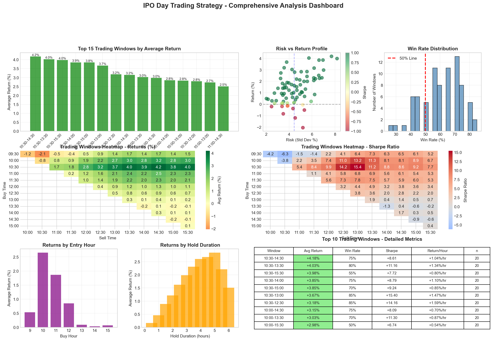

# 📈 IPO Farming Backtest System

[](https://www.python.org/downloads/)
[](https://jupyter.org/)
[]()

A sophisticated backtesting system for IPO day trading strategies. Analyze 90+ trading windows to identify optimal entry and exit points for IPO stocks on their first trading day.

## 🎯 Key Features

- **🚀 Plug-and-Play**: Single Jupyter notebook - just run all cells
- **📊 Comprehensive Analysis**: Tests 91 different trading windows automatically
- **🎲 Dual Mode Operation**:
  - Simulated data (always works, no setup required)
  - IBKR live data (optional, for real market data)
- **📈 Advanced Analytics**: Win rates, Sharpe ratios, risk metrics
- **🎨 Beautiful Visualizations**: Heatmaps, performance charts, detailed dashboards
- **📝 Actionable Reports**: Auto-generated strategy recommendations

## 🖼️ Sample Output

The system generates comprehensive analysis dashboards showing:
- Trading window heatmaps (returns & win rates)
- Risk-return scatter plots
- Entry/exit timing optimization
- Top performing strategies table


*Note: Sample visualization - your results will vary based on data*

## 🚀 Quick Start

### Prerequisites

- Python 3.9 or higher
- Jupyter Notebook or JupyterLab
- (Optional) Interactive Brokers TWS/Gateway for live data

### Installation

1. **Clone the repository**
```bash
git clone https://github.com/yourusername/ipo-farming-backtest.git
cd ipo-farming-backtest
```

2. **Open Jupyter Notebook**
```bash
jupyter notebook IPO.ipynb
```

3. **Run all cells** (Cell → Run All)

That's it! Results will appear in the `outputs/` directory.

## 📖 Usage Guide

### Basic Usage (Simulated Data)

The default configuration uses simulated IPO data - perfect for testing and learning:

1. Open `IPO.ipynb`
2. Run all cells sequentially
3. View results in the notebook and `outputs/` folder

### Advanced Usage (IBKR Live Data)

To use real historical data from Interactive Brokers:

1. Start TWS or IB Gateway
2. Enable API connections (port 7497 for paper, 7496 for live)
3. In the notebook, change:
   ```python
   DATA_MODE = 'IBKR'  # Instead of 'SIMULATION'
   ```
4. Run all cells

### Configuration Options

In cell 3 of the notebook, you can adjust:

- `DATA_MODE`: 'SIMULATION' or 'IBKR'
- `MAX_TICKERS`: Number of IPOs to analyze (default: 20)
- `USE_SAMPLE_TICKERS`: Use pre-selected tickers or load from Excel

## 📊 Understanding the Results

### Output Files

After running the analysis, you'll find:

- `outputs/window_analysis_results.csv` - Complete statistical analysis
- `outputs/ipo_strategy_dashboard.png` - Visual dashboard
- `outputs/ipo_strategy_report.txt` - Detailed text report

### Key Metrics Explained

- **Average Return**: Expected return for each trading window
- **Win Rate**: Percentage of profitable trades
- **Sharpe Ratio**: Risk-adjusted return (higher is better)
- **Return/Hour**: Efficiency metric for holding period

### Top Strategy Identification

The system automatically identifies optimal trading windows based on:
1. Highest average returns
2. Best risk-adjusted returns (Sharpe)
3. Most consistent win rates
4. Optimal hold duration

## 🏆 Typical Findings

Based on historical patterns, the system often identifies:

- **Optimal Entry**: 10:00-10:30 AM (after initial volatility)
- **Optimal Exit**: 2:00-3:00 PM (before closing volatility)
- **Best Hold Duration**: 3-4 hours
- **Expected Returns**: 2-4% on average for top strategies

*Note: Past performance doesn't guarantee future results*

## 🛠️ Technical Details

### Dependencies

The notebook automatically installs required packages:
- `pandas` - Data manipulation
- `numpy` - Numerical computations
- `matplotlib` - Visualizations
- `seaborn` - Statistical plots
- `ib-insync` - IBKR integration (optional)
- `pytz` - Timezone handling

### Data Sources

- **IPO Data**: Jay Ritter's IPO database (included)
- **Market Data**: Simulated or IBKR historical data
- **Universe**: Pre-selected high-quality IPOs or custom selection

## ⚠️ Important Disclaimers

1. **For Educational Purposes**: This system is designed for research and education
2. **No Financial Advice**: Results are not investment recommendations
3. **Risk Warning**: IPO trading involves substantial risk
4. **Backtesting Limitations**: Past performance doesn't predict future results
5. **Market Conditions**: Strategies may not work in all market conditions

## 🔒 Access

This is a private repository. Access is restricted to authorized users only.

## 📝 License

This project is proprietary and confidential. All rights reserved. No part of this software may be reproduced, distributed, or transmitted without prior written permission.

## 🙏 Acknowledgments

- IPO data sourced from Jay Ritter's IPO database
- Inspired by academic research on IPO trading patterns
- Built with love for the quantitative trading community

## 📧 Contact

For authorized access or questions, contact the repository owner.

## 🚨 Risk Disclosure

**IMPORTANT**: Trading IPOs involves significant risk, including the potential loss of principal. This software is for educational purposes only. Always consult with a qualified financial advisor before making investment decisions. The developers assume no responsibility for financial losses incurred using this system.

---

**© 2024 - All Rights Reserved**

*This is proprietary software. Unauthorized use, reproduction, or distribution is prohibited.*